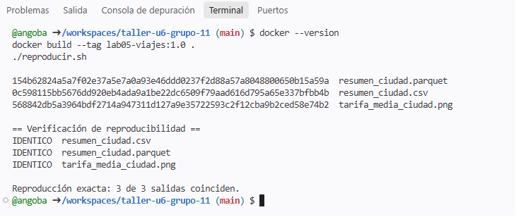
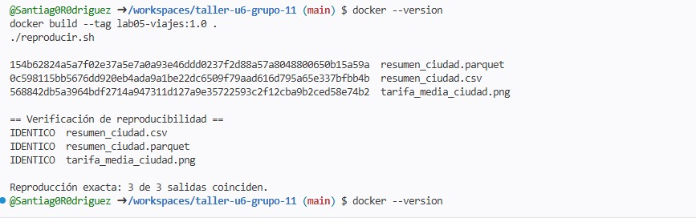
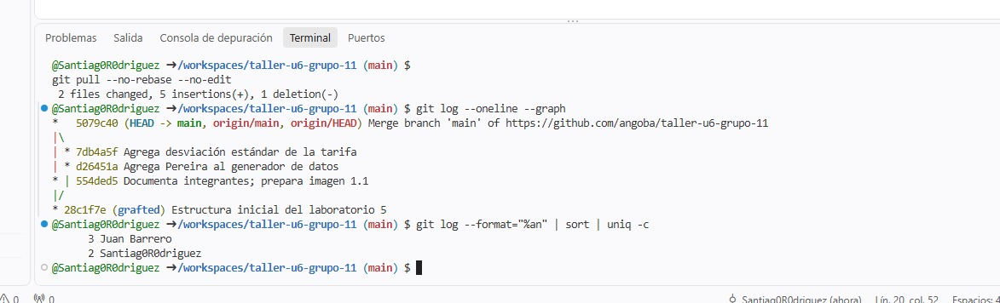

Archivo: INFORME.md
# Informe del taller · Unidad 6 · Grupo 11
 
## 1. Repositorio e integrantes
Enlace al repositorio: https://github.com/angoba/taller-u6-grupo-11

## Integrantes y roles
- R1, responsable del repositorio: <Juan_Diego_Barrero> (@angoba)
- R2, R3 - responsable de datos: <Edwin_Santiago_Rodriguez_Castillo> (@Santiag0R0driguez)

 
## 2. Reproducción de la versión 1.0 (M2)
Para cada integrante: última línea de ./reproducir.sh y las tres huellas obtenidas.

R1: Juan Diego Barrero 

R2: Santiago Rodriguez

 
## 3. Trabajo en paralelo (M3)
Salida de git log --oneline --graph y del conteo de confirmaciones por autor.

git log --oneline --graph
*   5079c40 (HEAD -> main, origin/main, origin/HEAD) Merge branch 'main' of https://github.com/angoba/taller-u6-grupo-11
|\  
| * 7db4a5f Agrega desviación estándar de la tarifa
| * d26451a Agrega Pereira al generador de datos
* | 554ded5 Documenta integrantes; prepara imagen 1.1
|/  
* 28c1f7e Estructura inicial del laboratorio 5
* 9d776e3 Create README.md

@angoba ➜ /workspaces/taller-u6-grupo-11 (main) $ git log --format="%an" | sort | uniq -c
      4 Juan Barrero
      2 Santiag0R0driguez

las fotos de las evidencias de ambos están en la raíz del repositorio.

## 4. Versión 1.1 (M4)
Tabla de seis ciudades, huellas obtenidas por cada integrante y explicación
de por qué Bogotá, Medellín y Cali no cambiaron.
Si algún integrante tuvo que reconstruir o recrear su codespace en M0: qué
síntoma tuvo y qué lo resolvió.
 
## 5. Diagnósticos (M5)
Para la semilla, la versión sin fijar y el .gitignore: salida obtenida y
explicación de dos o tres líneas con los términos de la unidad.
 
## 6. Semilla del proyecto (M6)
Idea elegida, enlace a proyecto/README.md y salida de docker run --rm proyecto:0.1.

