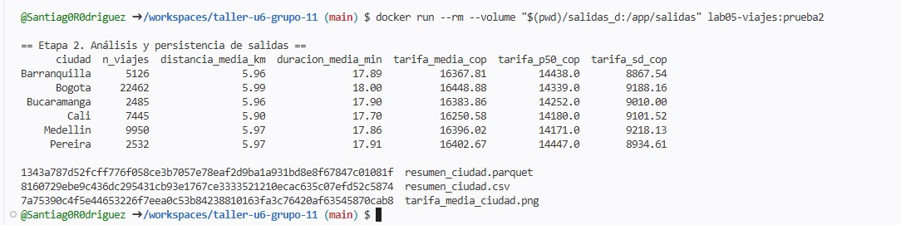
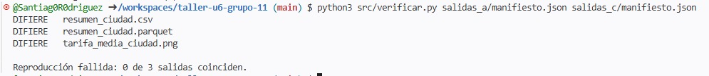
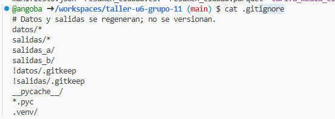

Archivo: INFORME.md
# Informe del taller · Unidad 6 · Grupo 11
 
## 1. Repositorio e integrantes
Enlace al repositorio: https://github.com/angoba/taller-u6-grupo-11

## Integrantes y roles
- R1, responsable del repositorio: <Juan_Diego_Barrero> (@angoba)
- R2, R3 - responsable de datos: <Edwin_Santiago_Rodriguez_Castillo> (@Santiag0R0driguez)

 
## 2. Reproducción de la versión 1.0 (M2)
Para cada integrante: última línea de ./reproducir.sh y las tres huellas obtenidas.

R1: Juan Diego Barrero 

R2: Santiago Rodriguez

 
## 3. Trabajo en paralelo (M3)
Salida de git log --oneline --graph y del conteo de confirmaciones por autor.

git log --oneline --graph
*   5079c40 (HEAD -> main, origin/main, origin/HEAD) Merge branch 'main' of https://github.com/angoba/taller-u6-grupo-11
|\  
| * 7db4a5f Agrega desviación estándar de la tarifa
| * d26451a Agrega Pereira al generador de datos
* | 554ded5 Documenta integrantes; prepara imagen 1.1
|/  
* 28c1f7e Estructura inicial del laboratorio 5
* 9d776e3 Create README.md

@angoba ➜ /workspaces/taller-u6-grupo-11 (main) $ git log --format="%an" | sort | uniq -c
      4 Juan Barrero
      2 Santiag0R0driguez

las fotos de las evidencias de ambos están en la raíz del repositorio.

## 4. Versión 1.1 (M4)

La versión 1.1 incorpora dos cambios principales respecto a la versión anterior:
la inclusión de Pereira en el generador de datos y el cálculo de la desviación
estándar de la tarifa.

Bogotá, Medellín y Cali conservan los mismos resultados de la versión 1.0 porque
los primeros tramos de probabilidad utilizados para asignar las ciudades no fueron
modificados.Como el generador utiliza la misma semilla, se mantiene la misma secuencia de
números aleatorios. Por esta razón, los registros que caían dentro de los primeros
tramos de probabilidad siguen asignándose a Bogotá, Medellín y Cali, mientras que
los cambios afectan únicamente los últimos tramos de la distribución.

 
## 5. Diagnósticos (M5)
Para la semilla, la versión sin fijar y el .gitignore: salida obtenida y
explicación de dos o tres líneas con los términos de la unidad.

Al cambiar la semilla de `20260917` a `20260918`, cambia la secuencia de números
pseudoaleatorios utilizada por el generador de datos. Por esta razón se genera un
conjunto de observaciones diferente y, en consecuencia, también cambian los
resultados derivados del análisis.

La comparación de los manifiestos produjo tres resultados `DIFIERE` y una
reproducción fallida de 0 de 3 salidas coincidentes. Esto demuestra que la semilla
forma parte de las condiciones necesarias para reproducir exactamente el análisis.

Las carpetas de datos y salidas contienen archivos generados durante la ejecución
del análisis, pero `git status` no los muestra como cambios pendientes porque
están excluidos mediante el archivo `.gitignore`. Esto evita incorporar al repositorio público archivos de datos y resultados
derivados que pueden volver a generarse a partir del código. De esta manera, el
repositorio conserva principalmente los archivos necesarios para reproducir el
análisis, en lugar de almacenar salidas generadas automáticamente.

 
## 6. Semilla del proyecto (M6)

Brechas en Saber 11 entre colegios oficiales y privados
https://github.com/angoba/taller-u6-grupo-11/blob/main/README.md

@Santiag0R0driguez ➜ /workspaces/taller-u6-grupo-11 (main) $ docker build --tag proyecto:0.1 proyecto/
[+] Building 0.4s (9/9) FINISHED                                                                                                                                 docker:default
 => [internal] load build definition from Dockerfile                                                                                                                       0.0s
 => => transferring dockerfile: 248B                                                                                                                                       0.0s
 => [internal] load metadata for docker.io/library/python:3.12-slim-bookworm                                                                                               0.1s
 => [internal] load .dockerignore                                                                                                                                          0.0s
 => => transferring context: 2B                                                                                                                                            0.0s
 => [1/4] FROM docker.io/library/python:3.12-slim-bookworm@sha256:54c85f3c47607a77f32adec749d3c81d1348bf25833671f512b26a9b6d778cb3                                         0.0s
 => => resolve docker.io/library/python:3.12-slim-bookworm@sha256:54c85f3c47607a77f32adec749d3c81d1348bf25833671f512b26a9b6d778cb3                                         0.0s
 => [internal] load build context                                                                                                                                          0.0s
 => => transferring context: 37B                                                                                                                                           0.0s
 => CACHED [2/4] WORKDIR /app                                                                                                                                              0.0s
 => CACHED [3/4] COPY requirements.txt .                                                                                                                                   0.0s
 => CACHED [4/4] RUN pip install --no-cache-dir -r requirements.txt                                                                                                        0.0s
 => exporting to image                                                                                                                                                     0.1s
 => => exporting layers                                                                                                                                                    0.0s
 => => exporting manifest sha256:b2b2ca990e6551cd551df10b09bc598675e6fde565091859515195eff709d7f5                                                                          0.0s
 => => exporting config sha256:39e2b7aa616ca8ced87d895e6767fdc77ffc9ba2a3df7f47591c355c1582d772                                                                            0.0s
 => => exporting attestation manifest sha256:46cb11065b7ae256136d2452aaba2e3d0f921ff1106e0c4c50917c5751b71491                                                              0.0s
 => => exporting manifest list sha256:b7235265466c65da1fb8dc145bc3b6fcd605d49f2030bb00745f99c2144c0138                                                                     0.0s
 => => naming to docker.io/library/proyecto:0.1                                                                                                                            0.0s
 => => unpacking to docker.io/library/proyecto:0.1                                                                                                                         0.0s
@Santiag0R0driguez ➜ /workspaces/taller-u6-grupo-11 (main) $

